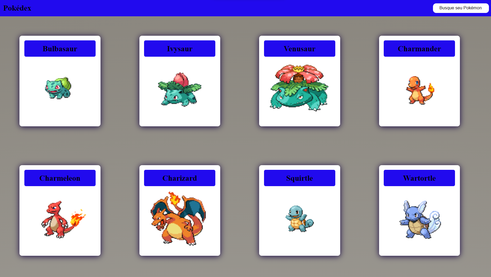
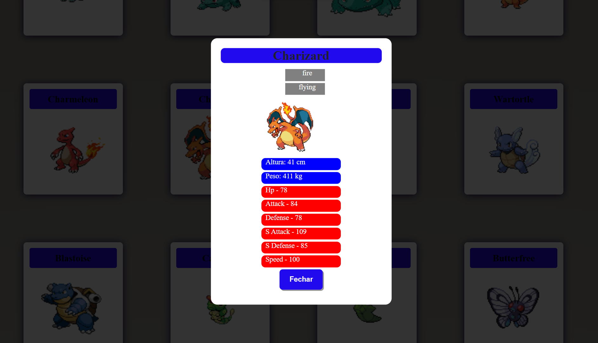

# pokedex-vuejs

>Resultado do Pokédex.

>clique aqui => https://cepbusqueja.netlify.app/

O projeto Foi desenvolvido usando as seguintes tecnologias:

- [x] Vuejs
- [x] Consumindo API
## 🤝 Colaboradores

Agradecemos às seguintes pessoas que contribuíram para este projeto:

<table>
  <tr>
    <td align="center">
      <a href="https://www.linkedin.com/in/danilo-vieira-10515123a/">
         
        
          <b>Danilo Vieira</b>
        
      </a>
    </td>
</table>